# STORE HAPPY MONGOSEW

**Descrição:** 
O Store Happy Mongose é uma plataforma de ecommerce dedicada à intermediação de jogos. Seu principal objetivo é proporcionar aos usuários uma experiência fluida e conveniente ao adquirir seus jogos favoritos. Através da plataforma, os usuários podem efetuar login, explorar a variedade de jogos disponíveis para compra e completar suas transações. O sistema inclui um carrinho de compras para facilitar o gerenciamento dos itens selecionados, bem como a conclusão do pedido, que resulta na geração de um código de resgate para o jogo adquirido.
Além disso, o sistema oferece a funcionalidade de cadastro de jogos para venda, permitindo que os usuários também atuem como vendedores, gerenciando seus próprios produtos dentro da plataforma. Isso proporciona uma oportunidade adicional para os usuários compartilharem seus jogos e contribuírem para a diversidade de opções disponíveis no Store Happy Mongose.

## Índice
- [Introdução](#introdução)
- [Instalação](#instalação)
- [Uso](#uso)
- [Contribuição](#contribuição)
- [Ferramentas](#ferramentas)
- [Diagrama de Classes](#diagrama)


## Introdução

O Store Happy Mongose apresenta uma série de funcionalidades essenciais que o tornam uma plataforma útil e eficiente para os entusiastas de jogos:

1. **Intermediação de Compras:** O sistema permite aos usuários explorar uma ampla gama de jogos disponíveis para compra, oferecendo uma experiência de compra conveniente e centralizada.

2. **Login de Usuário:** Os usuários podem criar contas personalizadas e realizar login, o que proporciona uma experiência personalizada e segura ao navegar e comprar jogos na plataforma.

3. **Carrinho de Compras:** Um carrinho de compras intuitivo permite que os usuários selecionem e gerenciem os itens que desejam adquirir, simplificando o processo de compra.

4. **Finalização de Pedido:** Após selecionar os jogos desejados, os usuários podem concluir o pedido de forma rápida e fácil, resultando na geração de um código de resgate para cada jogo adquirido.

5. **Cadastro de Jogos para Venda:** Os usuários têm a oportunidade de cadastrar jogos para venda na plataforma, permitindo que contribuam para a diversidade de opções disponíveis e também possam ganhar com suas vendas.

O Store Happy Mongose é útil por várias razões:

- **Conveniência:** Oferece aos jogadores uma plataforma centralizada para descobrir, comprar e resgatar jogos, economizando tempo e esforço na busca por novos títulos.

- **Variedade de Jogos:** Com uma ampla seleção de jogos disponíveis para compra e venda, o Store Happy Mongose atende aos interesses de uma vasta gama de jogadores, desde os aficionados por jogos de ação até os fãs de jogos de estratégia.

- **Segurança:** Ao fornecer um sistema de login e transações seguras, o Store Happy Mongose protege as informações dos usuários e oferece uma experiência de compra confiável.

- **Oportunidade de Venda:** Permite que os usuários não só comprem, mas também vendam seus próprios jogos, criando uma comunidade dinâmica e colaborativa de jogadores.

Em resumo, o Store Happy Mongose oferece uma plataforma abrangente e conveniente para a compra, venda e resgate de jogos, atendendo às necessidades e interesses da comunidade de jogadores de forma eficaz e segura.

## Instalação
Ao clonar o repositorio será necessario executar o comando </br>
```npm install```
se faz necessario  instalar o repositorio frontend em [Front](https://github.com/FelJohnny/e-commerce-front.git) 
precisa realizar as configurações do ```.env ``` sendo necessario entrar em conato com o criador [criador](https://github.com/FelJohnny)

## Contribuição
|Nome | Linkedin | Função  
|-----|----------|--------
| Felipe Johnny da Silva   | [ Linkedin ](https://www.linkedin.com/in/felipejohnny/ ) | Desenvolvedor
| Rafael Vieira da Silva   |  [ Linkedin ](https://www.linkedin.com/in/rafaelrvs/) | Desenvolvedor
| Gustavo Muniz dos Santos |  [Linkedin ](https://www.linkedin.com/in/gustavo-muniz-003184237/) | Documentação e tester
| Luis Felipe Gonçalves dos Santos |  [ Linkedin ](https://www.linkedin.com/in/luisfgsantos/) | Documentação e tester
  
 ## uso
   [ link para acesso: ](#teste)
   
 ## ferramentas
    - Visual studio code
    - Banco de dados mysql
    - Hospedagem Hostinger
    - React
    - css module
    - Sequilize
    - nodemon
    - jwt
  
    


# Fluxo de Atividades do Usuário Dentro do Sistema

## diagrama
## Diagrama de Classes

```mermaid

classDiagram
    Controller <|-- Produto_Controller
    Controller <|-- Rule_Controller
    Controller <|-- Pedido_Controller
    Controller <|-- Usuario_Controller

    Pedido_Controller --> Pedido_Services
    Pedido_Controller --> model
    Pedido_Controller --> jwt
    
    Produto_Controller --> Produto_Services
    Produto_Controller --> model
    Produto_Controller --> jwt

    Rule_Controller --> Rule_Services
    Rule_Controller --> model

    Usuario_Controller --> Usuario_Services
    Usuario_Controller --> model
    Usuario_Controller --> jwt

    Controller *-- Services : propsServices
    Controller *-- model : camposObrigatorios
    
    class Controller {
        - propsServices
        - camposObrigatorios
        - camposVazios
        + allowNull(req, res) bool
        + criaRegistroController(req, res)
        + pegaTodosController(req, res)
        + pegaUmRegistroPorIdController(req, res)
        + atualizaDadoController(req, res)
        + excluiRegistroController(req, res)
    }
    
    class Produto_Controller {
        + criaProdutoController(req, res)
        + pegaTodosProdutosPorPageController(req, res)
        + pegaProdutoPorIdController(req, res)
        + pegaProdutoPorUsuarioIdController(req, res)
        + atulizaProdutoController(req, res)
        + excluiRegistroController(req, res)
    }

    class Rule_Controller {
        + criaRegistroController(req, res)
        + pegaTodosController(req, res)
        + pegaUmRegistroPorIdController(req, res)
        + atualizaDadoController(req, res)
        + excluiRegistroController(req, res)
    }

    class Pedido_Controller {
        + criaPedidoController(req, res)
        + pegaPedidosPorUsuarioIdController(req, res)
    }

    class Usuario_Controller {
        + loginUsuarioController(req, res)
        + privateRouteUsrController(req, res)
        + registerUsuarioController(req, res)
    }

    class Produto_Services {
        + criaRegistro(dadosParaCriacao)
        + pegaTodosRegistros()
        + pegaUmRegistroPorId(id)
        + atualizaDado(dadosAtualizados, id)
        + excluiRegistro(id)
        + pegaTodosProdutosPorPageServices(itemStart, limit)
    }

    class Rule_Services {
        + criaRegistro(dadosParaCriacao)
        + pegaTodosRegistros()
        + pegaUmRegistroPorId(id)
        + atualizaDado(dadosAtualizados, id)
        + excluiRegistro(id)
    }

    class Pedido_Services {
        + criaPedido(dadosPedido, produtos)
        + pegaPedidosPorUsuarioId(id)
    }

    class Usuario_Services {
        + criaRegistro(dadosParaCriacao)
        + pegaTodosRegistros
        + pegaUmRegistroPorId(id)
        + atualizaDado(dadosAtualizados, id)
        + excluiRegistro(id)
        + pegaUmUsuarioPorId(id)
    }

    class Services {
        - nomeModel
        + criaRegistro(dadosDoRegistro)
        + pegaTodosRegistros()
        + pegaUmRegistroPorId(id)
        + pegaRegistroPorEmail(dado)
        + atualizaDado(dadosAtualizados, id)
        + excluiRegistro(id)
    }

    class model {
        + sequelize
        + Usuario
        + Produto
        + Rule
        + Pedido
        + ItensPedido
    }

    class jwt {
        + decode(token, secret)
    }

    Services <|-- Produto_Services
    Services <|-- Rule_Services
    Services <|-- Pedido_Services
    Services <|-- Usuario_Services
    Produto_Services --> model
    Pedido_Services --> model
    Usuario_Services --> model
    Usuario_Services --> bcrypt

    class Produto {
        + nome: STRING
        + preco: DOUBLE
        + status: BOOLEAN
        + capaProduto: STRING
        + usuarioId: INTEGER
        + associate(models)
    }

    class Rule {
        + nome: STRING
        + associate(models)
    }

    class Usuario {
        + email: STRING
        + senha: STRING
        + nomeCompleto: STRING
        + ruleId: INTEGER
        + associate(models)
    }

    class Pedido {
        + total: DOUBLE
        + status: STRING
        + usuarioId: INTEGER
        + associate(models)
    }

    Produto --> Usuario : "N..1"
    Rule --> Usuario : "1..1"
    Usuario --> Produto : "1..N"
    Pedido --> Usuario : "N..1"

    class Pedido_Routes {
        + post("/api/pedido")
        + get("/api/pedido/usuario/:id")
    }

    class Produto_Routes {
        + post("/api/produto")
        + get("/api/produto")
        + get("/api/produto/usuario/:id")
        + get("/api/produto/:id")
        + put("/api/produto/:id")
        + delete("/api/produto/:id")
    }

    class Rule_Routes {
        + post("/api/rules")
        + get("/api/rules")
        + get("/api/rules/:id")
        + put("/api/rules/:id")
        + delete("/api/rules/:id")
    }

    class Usuario_Routes {
        + post("/api/auth/login")
        + get("/api/auth/login/:id")
        + post("/api/auth/register")
    }

    Pedido_Routes --> Pedido_Controller
    Produto_Routes --> Produto_Controller
    Rule_Routes --> Rule_Controller
    Usuario_Routes --> Usuario_Controller

```

## Descrição
 - Controladores (Controllers)

### Controller:

### Classe base que contém métodos genéricos para operações CRUD (Create, Read, Update, Delete).
Métodos incluem:
|Métodos| 
|-----------|
|allowNull  | 
| criaRegistroController   | 
| pegaTodosController   | 
| pegaUmRegistroPorIdController   | 
| atulizaDadoController   | 
| excluiRegistroController   | 
| Produto_Controller   | 

### Estende a classe Controller e adiciona métodos específicos para produtos, como: 
|Métodos| 
|-----------|
| criaProdutoController   | 
| pegaTodosProdutosPorPageController   | 
| pegaProdutoPorIdController   | 

### Rule_Controller:
Estende a classe Controller e utiliza serviços específicos para regras, sem adicionar novos métodos.

### Pedido_Controller:
Adiciona métodos específicos para pedidos, como:
|Métodos| 
|-----------|
| criaPedidoController   | 
| pegaPedidosPorUsuarioIdController   | 

### Usuario_Controller:
Adiciona métodos específicos para usuários, como: 
|Métodos| 
|-----------|
| loginUsuarioController   | 
| privateRouteUsrController   | 
| registerUsuarioController   |

## Serviços (Services)
### Services:
Classe base que fornece métodos comuns para operações no banco de dados, como: 
|Métodos| 
|-----------|
| criaRegistro   | 
| pegaTodosRegistros   | 
| pegaUmRegistroPorId   | 
| atualizaDado   | 
| excluiRegistro   | 
### Produto_Services:
### Estende a classe Services e adiciona métodos específicos para produtos, como: 
|Métodos| 
|-----------|
| pegaTodosProdutosPorPageServices   | 


### Rule_Services:
Estende a classe Services sem adicionar novos métodos.

### Pedido_Services:
### Adiciona métodos específicos para pedidos, como: 
|Métodos| 
|-----------|
| criaPedido   | 
| pegaPedidosPorUsuarioId   | 

## Usuario_Services:
### Adiciona métodos específicos para usuários, como: 
|Métodos| 
|-----------|
| pegaUmUsuarioPorId   |

## Modelos (Models)
### Produto:
### Modelo que representa a tabela de produtos no banco de dados, com atributos como:
|Atributos| 
|-----------|
| nome   | 
| preco   | 
| status   | 
| capaProduto   | 
| usuarioId   | 

## Rule:
### Modelo que representa a tabela de regras no banco de dados, com um atributo
nome. Relaciona-se com Usuario.


## Usuario:
### Modelo que representa a tabela de usuários no banco de dados, com atributos como:
|Atributos| 
|-----------|
| email   | 
| senha   | 
| nomeCompleto   | 
| ruleId   | 
Relaciona-se com Produto e Rule.

## Pedido:

### Modelo que representa a tabela de pedidos no banco de dados, com atributos como:
|Atributos| 
|-----------|
| total   | 
| status   | 
| usuarioId   | 
Relaciona-se com Usuario.

## Outros Componentes
### model:
### Representa as conexões e modelos do banco de dados, incluindo: Produto, Rule, e Usuario. Utiliza Sequelize para definir e associar modelos.
## jwt:
### Utilizado para decodificar tokens JWT, garantindo a autenticação dos usuários.
## bcrypt:
### Utilizado para hash e verificação de senhas de usuários, garantindo a segurança dos dados.
### Interações e Relacionamentos
## Controladores e Serviços:
### Os controladores utilizam os serviços para realizar operações no banco de dados. Por exemplo,
> Produto_Controller utiliza Produto_Services para criar, ler, atualizar e excluir produtos.

## Modelos e Banco de Dados:
Os modelos representam as tabelas do banco de dados e definem os relacionamentos entre si. Por exemplo, 
> Produto pertence a Usuario, e Usuario pertence a Rule.
## Autenticação e Autorização:
Produto_Controller utiliza JWT para autenticação, garantindo que apenas usuários autenticados possam realizar certas operações. O uso de bcrypt em Usuario_Services garante que as senhas sejam armazenadas de forma segura.
# Fluxo de Operações
### Criação de Produto:
Um pedido para criar um produto é enviado para Produto_Controller.
O controlador valida os dados e verifica a autenticação do usuário usando JWT.
Se a validação e autenticação são bem-sucedidas, Produto_Services é chamado para salvar o novo produto no banco de dados.
A resposta é retornada ao cliente com o status da operação.

### Leitura de Produtos:
Um pedido para listar produtos é enviado para Produto_Controller.
O controlador chama Produto_Services para buscar os produtos no banco de dados, com suporte para paginação.
A resposta é retornada ao cliente com a lista de produtos e informações de paginação.

### Atualização de Produto:
Um pedido para atualizar um produto é enviado para Produto_Controller.
O controlador valida os dados e verifica a existência do produto.
Se a validação for bem-sucedida, Produto_Services é chamado para atualizar o produto no banco de dados.
A resposta é retornada ao cliente com o status da operação.

### Exclusão de Produto:
Um pedido para excluir um produto é enviado para Produto_Controller.
O controlador verifica a existência do produto.
Se o produto existe, Produto_Services é chamado para excluir o produto no banco de dados.
A resposta é retornada ao cliente com o status da operação.
