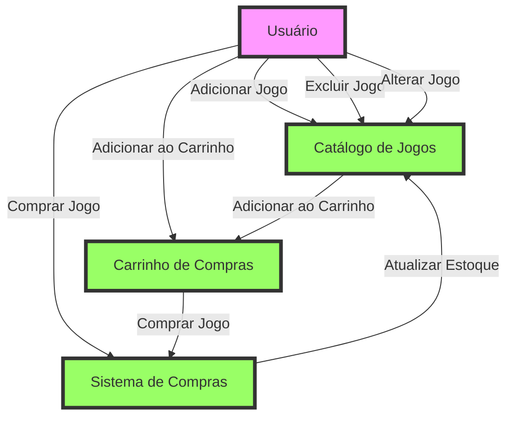
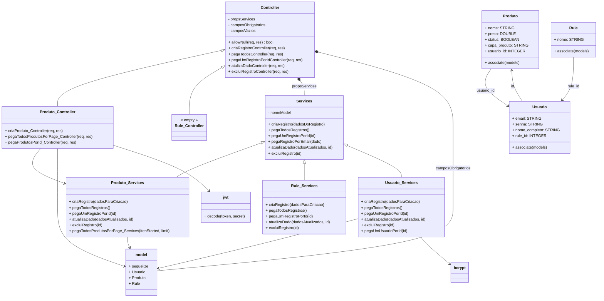

# Fluxo de atividades do usuario dentro do sistema

 ✔ O Usuário pode adicionar, excluir e alterar jogos no Catálogo de Jogos que está vinculado ao seu perfil. 
 ✔ O Usuário pode adicionar jogos ao Carrinho de Compras. 
 ✔ O Usuário pode comprar jogos através do Sistema de Compras. 
 ✔ O Carrinho de Compras pode se comunicar com o Sistema de Compras para finalizar a compra. 
 ✔ O Sistema de Compras" atualiza o estoque no Catálogo de Jogos após uma compra. 

 # Diagrama de Classe :

 ## Descrição:
 Controladores (Controllers)

➤ **Controller:**   Classe base que contém métodos genéricos para operações CRUD (Create, Read, Update, Delete).   Métodos incluem:  
- allowNull,  
- criaRegistroController,  
- pegaTodosController, 
- pegaUmRegistroPorIdController, 
- atulizaDadoController, e excluiRegistroController.  

➤ **Produto_Controller:**   Estende a classe Controller e adiciona métodos específicos para produtos, como:
- criaProduto_Controller, 
- pegaTodosProdutosPorPage_Controller e pegaProdutosPorId_Controller. 
Rule_Controller:   Estende a classe Controller e utiliza serviços específicos para regras, sem adicionar novos métodos. 
➤ **Serviços (Services)**  
 **Services:**   Classe base que fornece métodos comuns para operações no banco de dados, como:
 - criaRegistro,  
 - pegaTodosRegistros,  
 - pegaUmRegistroPorId, 
 -atualizaDado e excluiRegistro. 
➤ **Produto_Services:**   Estende a classe Services e adiciona métodos específicos para produtos, como  
  - pegaTodosProdutosPorPage_Services. 
➤ **Rule_Services:** Estende a classe Services sem adicionar novos métodos. 
➤ **Usuario_Services:**   Estende a classe Services e adiciona métodos específicos para usuários, como: 
- pegaUmUsuarioPorId. 
➤ **Modelos (Models)**  
➤ **Produto:  ** Modelo que representa a tabela de produtos no banco de dados, com atributos como nome, preco, status, capa_produto e usuario_id. Relaciona-se com Usuario. 
➤ **Rule:**   Modelo que representa a tabela de regras no banco de dados, com um atributo nome. Relaciona-se com Usuario. 
➤ **Usuario:**   Modelo que representa a tabela de usuários no banco de dados, com atributos como email, senha, nome_completo e rule_id. Relaciona-se com Produto e Rule. 
**Outros Componentes**  
➤ **model:**   Representa as conexões e modelos do banco de dados, incluindo Produto, Rule, e Usuario. Utiliza Sequelize para definir e associar modelos. 
➤ **jwt:**   Utilizado para decodificar tokens JWT, garantindo a autenticação dos usuários. 
➤ **bcrypt:**   Utilizado para hash e verificação de senhas de usuários, garantindo a segurança dos dados. 
Interações e Relacionamentos 
Controladores e Serviços:   Os controladores utilizam os serviços para realizar operações no banco de dados. Por exemplo, Produto_Controller utiliza Produto_Services para criar, ler, atualizar e excluir produtos.
Modelos e Banco de Dados:   Os modelos representam as tabelas do banco de dados e definem os relacionamentos entre si. Por exemplo, Produto pertence a Usuario, e Usuario pertence a Rule.
Autenticação e Autorização:   Produto_Controller utiliza JWT para autenticação, garantindo que apenas usuários autenticados possam realizar certas operações. O uso de bcrypt em Usuario_Services garante que as senhas sejam armazenadas de forma segura.
Fluxo de Operações
Criação de Produto:  

Um pedido para criar um produto é enviado para Produto_Controller.
O controlador valida os dados e verifica a autenticação do usuário usando JWT.
Se a validação e autenticação são bem-sucedidas, Produto_Services é chamado para salvar o novo produto no banco de dados.
A resposta é retornada ao cliente com o status da operação.
Leitura de Produtos:

Um pedido para listar produtos é enviado para Produto_Controller.
O controlador chama Produto_Services para buscar os produtos no banco de dados, com suporte para paginação.
A resposta é retornada ao cliente com a lista de produtos e informações de paginação.
Atualização de Produto:

Um pedido para atualizar um produto é enviado para Produto_Controller.
O controlador valida os dados e verifica a existência do produto.
Se a validação for bem-sucedida, Produto_Services é chamado para atualizar o produto no banco de dados.
A resposta é retornada ao cliente com o status da operação.
Exclusão de Produto:

Um pedido para excluir um produto é enviado para Produto_Controller.
O controlador verifica a existência do produto.
Se o produto existe, Produto_Services é chamado para excluir o produto no banco de dados.
A resposta é retornada ao cliente com o status da operação.

